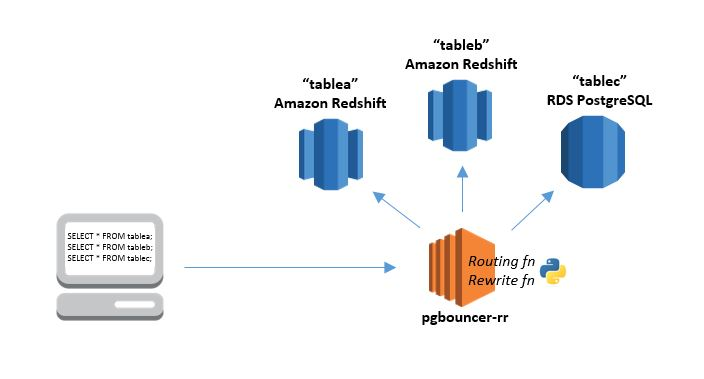
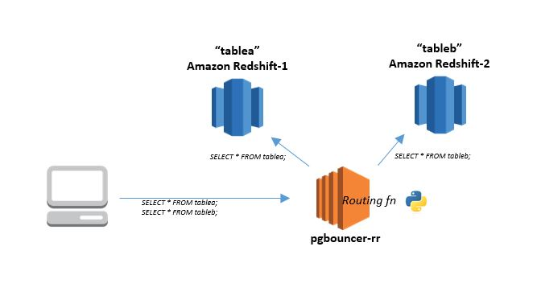

# Query Routing and Rewrite: pgbouncer-rr
İstemci uygulamalarınızın yapılandırmasını veya kodunu etkilemeden, veritabanı yükünüzü birden çok sunucuya veya clustera bölmeyi hiç istediniz mi? Ya da uygulama sorgularını engellemek ve değiştirmek için bir yol istediniz, böylece en iyi duruma getirilmiş tablolar (sorted, pre-joined, pre-aggregated vb.) oluşturabilir, güvenlik filtreleri ekleyebilir veya şemada yaptığınız değişiklikleri gizleyebilirsiniz.

[Pgbouncer-rr](https://github.com/awslabs/pgbouncer-rr-patch) projesi, açık kaynaklı bir PostgreSQL connection pooler olan [pgbouncer](http://www.pgbouncer.org/usage.html#description)'a dayanıyor ve iki yeni önemli özellik ekliyor:

1. **Routing:** farklı istemci bağlantılarından gelen sorguları farklı veritabanlarına yönlendirir; birden fazla servers/clusters arasında partition or load balance için kullanılır.
2. **Rewrite:** istemci sorguları sunucuya gönderilmeden önce araya girerek programsal olarak istemci sorgularını değiştirir: uygulamanızı değiştirmeden sorguları optimize etmek veya başka şekilde değiştirmek için kullanılır.



Pgbouncer-rr, pgbouncer ile aynı şekilde çalışır. Herhangi bir hedef uygulama sanki bir Amazon Redshift veya PostgreSQL sunucusuymuş gibi pgbouncer-rr'ye bağlanır ve pgbouncer-rr asıl sunucuya bir bağlantı oluşturur veya mevcut bir bağlantıyı yeniden kullanır.

## Query Routing

Yönlendirme özelliği, sağladığınız bir Python yönlendirme fonksiyonunu kullanarak istemci bağlantılarını sunucu bağlantılarına eşler. Fonksiyonunuz parametre olarak, her kullanıcı için istemci kullanıcı adı ve sorguyu alır. Return değeri sizin belirlediğiniz veritabanı sunucusu olmalıdır.
Örneğin: replica clusterlar veya sunucular arasında kontrollü yük dengeleme (veya A/B testi) uygulamak isteyebilirsiniz. Yönlendirme fonksiyonunuz; istemci kullanıcı adı, sorgu, rasgele değişkenler veya harici girişin herhangi bir kombinasyonuna bağlı olarak her sorgu için bir sunucu seçebilir.Kısaca yönlendirme özelliği istediğiniz kadar basit veya karmaşık olabilir. 

Python yönlendirme fonksiyonu, yapılandırmada belirttiğiniz dosyadan pgbouncer-rr tarafından dinamik olarak yüklenir:  
`routing_rules_py_module_file = /etc/pgbouncer-rr/routing_rules.py`  
Dosya aşağıdaki Python fonksiyonunu içermelidir:    
`def routing_rules(username, query):`   

- Fonksiyon parametreleri, istemciyle ilişkili kullanıcı adını ve bir sorgu dizesini sağlar.
- Fonksiyonun dönüş değeri, yapılandırma dosyasında belirtildiği şekilde geçerli bir veritabanı anahtarı adı (dbkey) veya `None` olmalıdır:
    
    - Yönlendirme fonksiyonu tarafından geçerli bir dbkey döndürüldüğünde, istemci bağlantısı belirtilen sunucu bağlantı havuzundaki bir bağlantıya yönlendirilir. 
    - `None` yönlendirme fonksiyonu tarafından döndürüldüğünde, istemci geçerli sunucu bağlantısına yönlendirilir.


**NOT**
- Tüm sorgular atanan sunucuda tümüyle çalıştırılmalıdır; çapraz sunucu birleştirmeleri çalışmıyor.
- İdeal olarak sorgular her deyimi otomatik olarak işlemelidir. Yapılandırma `pool_mode = statement` ayarlayın.
- Multi-statement transactionlar, yalnızca ifadeler routing_rules fonksiyonu tarafından işlem ortasında farklı bir sunucu havuzuna yönlendirilmezse düzgün çalışır. Yapılandırma dosyasını `pool_mode = transaction` ayarlayın. 
- Uygulamanız şemayı bulmak için veritabanı katalog tablolarını kullanıyorsa, routing_rules.py fonksiyonu katalog tablosu sorgularını, tüm ilgili şema nesnelerinin oluşturulduğu bir veritabanı sunucusuna yönlendirmelidir.

#### Basit Query Routing Örneği 

Konunun ve konseptin anlaşılması için basit bir örnek üzerinden açıklayacak olursak: Amazon Redshift cluster 1, 'tablea' tablosundaki verilere, Amazon Redshift cluster 2'de 'tableb' tablosundaki verilere sahibtir. Hangi tablonun hangi veritabanında olduğunu bilmeye gerek kalmadan sorgu gönderebilir ve her iki tabloya bir veritabanından erişebilirsiniz.     

Pgbouncer [yapılandırma dosyasında](https://www.pgbouncer.org/config.html) (pgbouncer.ini)  [databases] bölümünde 'dev' isimli varsayılan bir giriş oluşturuyoruz. Bu giriş, 'dev' veritabanına istemci bağlantıları için kullanılan varsayılan clusterı belirler. Redshift1 veya redshift2'yi varsayılan olarak ayarlayabilir veya hatta üçüncü bir 'varsayılan' cluster belirleyebilirsiniz. Verilen isimler unique olması şartıyla size kalmıştır. Her cluster için pgbouncer [databases] bölümünde 'dev.1' ve 'dev.2' gibi ek girişler oluşturun.

```
[databases]
dev = host=<redshift1> port=5439 dbname=dev
dev.1 = host=<redshift1> port=5439 dbname=dev
dev.2 = host=<redshift2> port=5439 dbname=dev
```
Konfigrasyon dasyasında `routing_rules_py_module_file` ayarının `~/routing_rules.py` gibi python routing fonksiyon dosyanızın yolunu belirttiğinden emin olun.

`~/routing_rules.py` dosyasının içeriği:
```
def routing_rules(username, query):
	if "tablea" in query:
		return "dev.1"
	elif "tableb" in query:
		return "dev.2"
	else:
		return None
```



Bir client `SELECT * FROM tablea` sorgusunu gönderirse, ilk kuralla eşleşir ve 'dev.1' sunucu havuzuna atanır (redshift1).Bir client (aynı oturumdaki aynı client olabilir) `SELECT * FROM tableb` sorgusunu gönderirse, ikinci kuralla eşleşir ve 'dev.2' sunucu havuzuna atanır (redshift2). Kurallardan biriyle eşleşmeyen herhangi bir sorgu `None` döndürülmemesiyle sonuçlanır ve sunucu bağlantısı değişmeden kalır.

Aynı durumunda kullanılacak alternatif bir fonksiyon daha verecek olursak:
```
# ROUTING TABLE
# ensure all dbkey values are defined in [database] section of the pgbouncer ini file 
routingtable = {
	'route' : [{
			'usernameRegex' : '.*',
			'queryRegex' : '.*tablea.*',
			'dbkey' : 'dev.1'
		}, {
			'usernameRegex' : '.*',
			'queryRegex' : '.*tableb.*',
			'dbkey' : 'dev.2'
		}
	],
	'default' : None
}

# ROUTING FN - CALLED FROM PGBOUNCER-RR - DO NOT CHANGE NAME
# IMPLEMENTS REGEX RULES DEFINED IN ROUTINGTABLE OBJECT
# RETURNS FIRST MATCH FOUND
import re
def routing_rules(username, query):
	for route in routingtable['route']:
		u = re.compile(route['usernameRegex'])
		q = re.compile(route['queryRegex'])
		if u.search(username) and q.search(query):
			return route['dbkey']
	return routingtable['default']
```
Yönlendirme mantığı tabloda eşleşme bulmak için regular expressionlar kullanarak ayrı genişletilebilir veri yapısı şeklinde tanımlanabilir.

Büyük olasılıkla, istenmeyen eşleşmelerden kaçınmaya özen göstererek daha sağlam ve karmaşık kurallar uygulamak isteyeceksiniz. Fonksiyonunuzu farklı girişlerle çağırmak için test senaryoları yazın ve çıkış dbkey değerlerini doğrulayın.

**Kod kısmına girmeden önce hatırlamanız gerekenler:** 
- Tüm dbkey değerlerinin, pgbouncer.ini dosyadaki [databases] bölümünde tanımlandığından emin olun.
- Yönlendirme fonksiyonu Pgbouncer-rr'den çağırılır bu nedenle ismi değiştirilemez.
- Yönlendirme tablosu nesnelerini tanımlayacak REGEX (regular expression) kuralları uygulayın.
- Örnek sorgularla `routing_rules()` çağırın, döndürülen dbkey değerlerini doğrulayarak test edin.


## Query Rewrite


 
# Kurulum & Yapılandırma
Aşağıdaki komutları takip pgbouncer-rr'yi indirip yükleyin (Amazon Linux / RHEL / CentOS):

[](https://asciinema.org/a/15mGJZs5YpMGRYIA3vAyflFGK)

Kendi veritabanı bağlantılarınızı ve routing_rules.py/rewrite_query.py dosyalarının yolunu içeren ./pgbouncer-example.ini isminde bir yapılandırma dosyası oluşturun.

**Örnek konfigrasyon dosyası:**
```
[pgbouncer]
listen_port = 5439
listen_addr = *
auth_type = trust
auth_file = users.txt
pool_mode = transaction
logfile = ./pgbouncer.log
pidfile = ./pgbouncer.pid
admin_users = postgres
routing_rules_py_module_file = ./routing_rules.py
rewrite_query_py_module_file = ./rewrite_query.py
rewrite_query_disconnect_on_failure = true
ignore_startup_parameters=extra_float_digits

[databases]
dev = host=10.0.0.11 port=5432 dbname=postgres
dev.1 = host=10.0.0.11 port=5432 dbname=postgres
dev.2 = host=10.0.0.2 port=5432 dbname=postgres
```

- **pool_mode** Bir sunucu bağlantısının diğer istemciler tarafından ne zaman yeniden kullanılabileceğini belirtir.
	- *Session*: İstemci bağlantısı kesildikten sonra sunucu tekrar havuza bırakılır. Varsayılan.
	- *Transaction*: İşlem bittikten sonra sunucu tekrar havuza bırakılıyor.
	- *Statement*: Sorgu tamamlandıktan sonra sunucu tekrar havuza bırakılır. Birden çok ifadeyi kapsayan uzun işlemlere bu modda izin verilmez.
- **listen_port**  TCP bağlantılarını dinlemek istediğiniz adres.  `*` tüm adresleri ifade eder.
-  **auth_type & auth_file**, PgBouncer'a bağlanırken kullanıcıların kimliğini nasıl doğrulamasını istediğinizi belirtir. users.txt dosyası kullanıcı ismi ve şifre ikilisi içerir. 

**örnek users.txt**
```
"app1" "md5<MD5 hash password+username>"
"app2" "md5<MD5 hash password+username>"
"app_admin" "md5<MD5 hash password+username>"
"app_admin2" "md5<MD5 hash password+username>"
"postgres" "postgres123"
```
- **admin_user** kısmında `users.txt` kullanıcılarınızı PgBouncer hakkında performansla ilgili bilgiler sağlayan özel bir pgbouncer veritabanına erişebilecek yöneticiler olarak atayabilirsiniz.

## Başlatma & Bağlanma
`pgbouncer <config_file> -d` komut kullanarak pgbouncer-rr'yi daemon programı olarak çalıştırın.
Komut satırı seçenekleri için `pgbouncer --help`'e bakabilirsiniz. Log dosyasına dikkatlice bakarsanız query routing ve query rewrite özelliklerinin çalıştığını görebilirsiniz

İstemci uygulamanızı doğrudan Redshift veya PostgreSQL veritabanına bağlanıyormuş gibi yapılandırın, ancak pgbouncer-rr'nin hostname ve listening port noktasını kullandığınızdan emin olun.
```
psql -h pgbouncer-dnshostname -U dbuser -d dev -p 5439 
```


# Kaynak

https://github.com/awslabs/pgbouncer-rr-patch/blob/master/README.md   
https://medium.com/tensult/introducing-pgbouncer-rr-for-postgresql-198a3596ac2e   
https://medium.com/tensult/pgbouncer-routing-and-rewriting-for-postgresql-using-python-14b12d6595d
https://www.compose.com/articles/how-to-pool-postgresql-connections-with-pgbouncer/